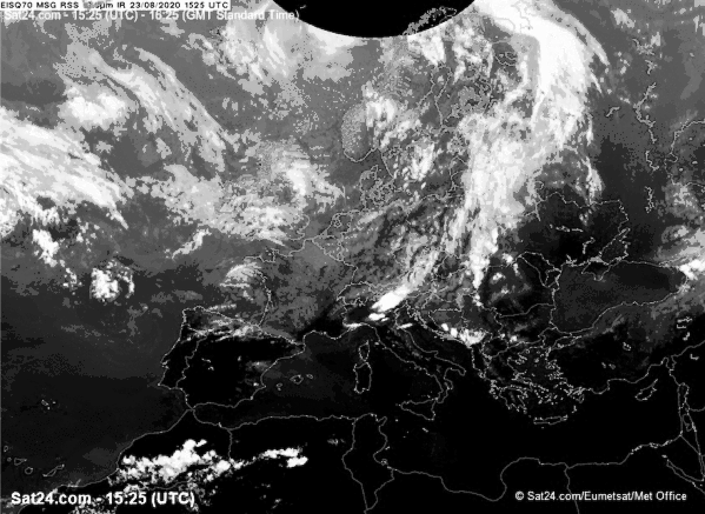
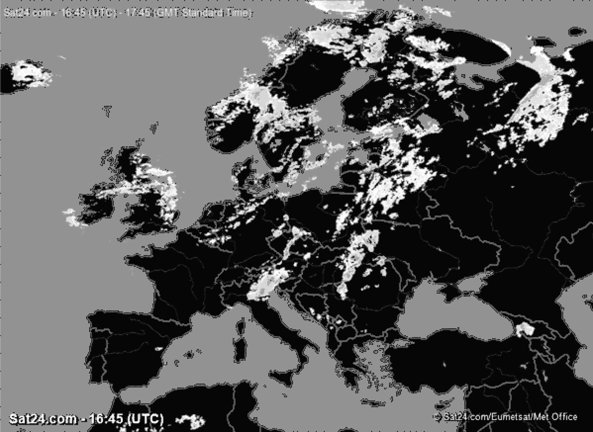
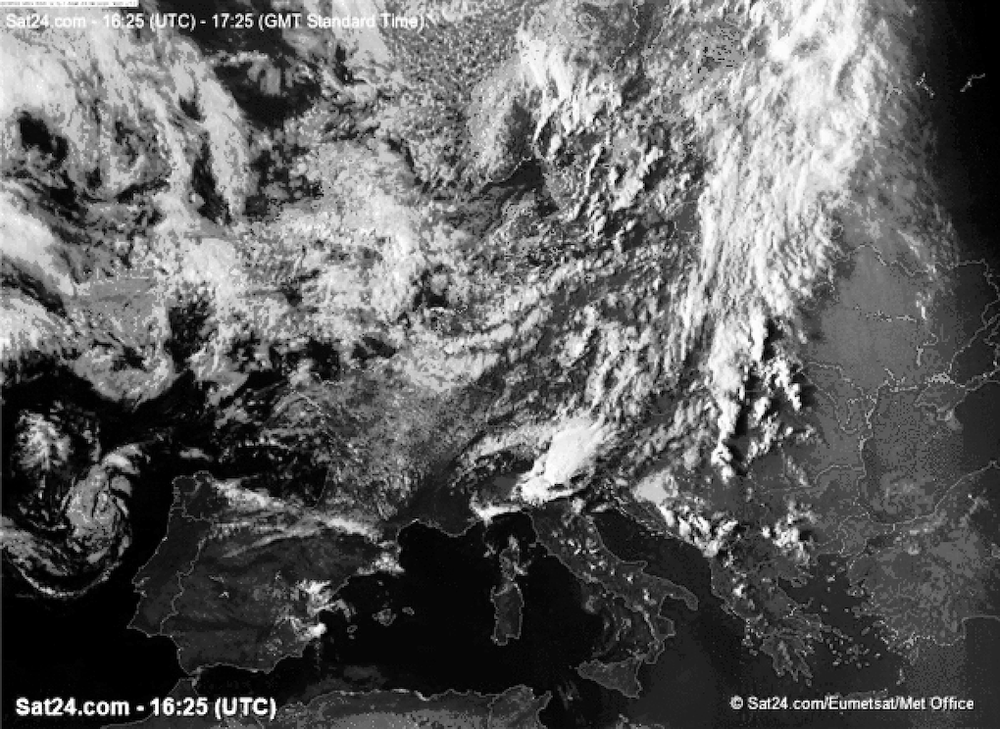

# Sat24-image-scrapper

A simple python script to extract Sat24 satellite images of Africa, Europe and Oceania's weather.

The images will have a 15 minute refresh interval. You have to update the images by hand. Refer to `Controls`.

## Requirements
    numpy (tested on version 1.19.1)
    opencv2 (tested on version 4.4.0.42)
    pillow (tested on  version 7.2.0)
    requests (tested on version 2.24.0)
To install the requirements run (**this will install the versions above**):
    
    pip3 install -r requirements.txt

A virtual environment is recommended to avoid overriding any existing versions.
    
## Controls

Run `python3 src/main.py --help` for a list of parameters.

You can use the following parameters:
- `--africa` to show images for the African Continent
- `--europe` to show images for the European Continent
- `--oceania` to show images of Oceania
- A combination of the previous ones to load multiple continents at the same time

Images may take some time to load.

**While application is running:**

Press `u` to update all images. This may take a while.

Press `ESC` to exit the application

## Example Images

The following images will be displayed:

 

**Infrared**

 

**Rain**

 

**Visible**

## Fix me!

The downloaded images are automatically converted to gray. 
This is an unintended "feature". Work in progress...

## Additional info

- Oceania will only show Infrared and visible. Sat24 does not support rain for Oceania.

- The images present in this repository may be subject to copyright
